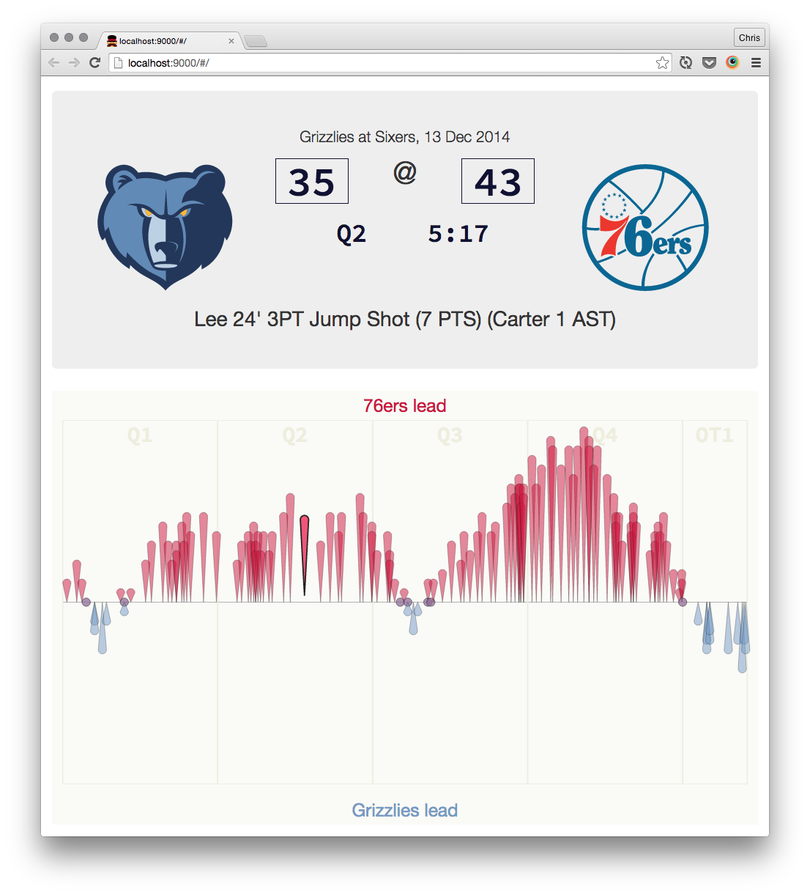

# game-flow

This app generates a data visualization of an NBA game. It is a work in progress. I'm using Angular to manage all of the data, and SVG to render the chart. The x-axis is the game clock, and the y-axis is the point differential. The top half of the chart represents a home team lead, the bottom half represents an away team lead. Hover over a game event (those are the colored markers on the chart) to see the details of the event displayed on the "scoreboard" at the top of the screen. Right now I'm using some sample game data that is stored within the app, but eventually users will be able to select the game they want to see and the app will go and grab the data from stats.nba.com.

This app was inspired by a similar visualization in the Memphis Grizzlies iOS app.

Go Grizz.

## Build & development

This project is generated with yo angular generator version 0.12.1.

Run `grunt` for building and `grunt serve` for preview.
